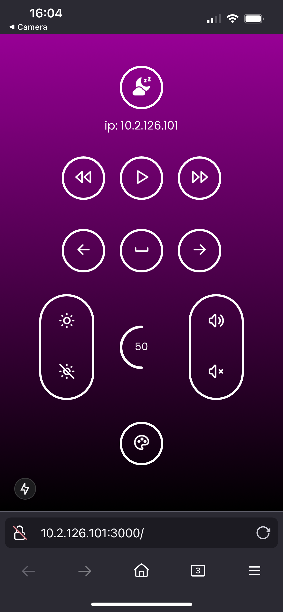

# Local Area Network IOS Remote for Mac 
An app that lets your phone trigger keypresses or OS events on a connected Mac running these servers. Designed to eliminate the need to walk to your computer when it’s connected to a TV via an HDMI cable 

## Overview


- go server runs on computer, allows access to os operations (mac)
- simple react client connected to same network (phone)
- network discovery through zeroconf
    - `dns-sd -R "lan_mac_remote_server" _http._tcp local 8080`: registers `lan_mac_remote_server` service which includes local ip address of current machine
    - [client/app/api/scan/route.ts](./client/app/api/scan/route.ts): searches for `lan_mac_remote_server` service on local network
- once service is found, we can send key press requests to the server from our phone through http over tcp/ip

Current keypress actions
- play/pause
- prev/next track
- brightness up/down
- volume up/down
- left/right arrow key press
- sleep

## Mac OS Setup
1. Clone repository `git clone https://github.com/akleventis/lan_mac_remote.git`

1. Ensure [go 1.23](https://go.dev/doc/install) is installed on system 

1. Install npm dependencies
   -  `cd client ; npm install`
   
1. Download and configure [Hammerspoon](https://www.hammerspoon.org/) (media controls proved to be quite tricy)

- Keypresses are triggered through Applescript, an apple scripting language that allows for control over some OS functions. For example, `brightness up` corresponds to a key code of `144`.

```bash
#!/bin/bash
osascript -e "tell application \"System Events\" to key code 144"
```

|Function key|Media key|
-|-
|F7|previous|
|F8|play/pause|
|F9|next|

These media controls are unique because they don’t use traditional key codes. For example, sending the key code for F8 (144) through AppleScript won’t trigger the play/pause action — it only simulates pressing the F8 key. This is because macOS handles media keys as system-level events, separate from standard key presses. 
  - Hammerspoon overcomes this limitation by directly sending system-level Play/Pause, Next, and Previous commands through key bindings.

- [download link](https://github.com/Hammerspoon/hammerspoon/releases/tag/1.0.0)
- After installation, open the app and follow steps allowing accessibility.
- click *Open Config* in the Hammerspoon menu. Copy this into the [init.lua](./init.lua)
```lua
-- Simulate Media Previous Track Key (F7)
hs.hotkey.bind({}, "F7", function()
    hs.eventtap.event.newSystemKeyEvent("PREVIOUS", true):post()
    hs.eventtap.event.newSystemKeyEvent("PREVIOUS", false):post()
end)

-- Simulate Media Play/Pause Key (F8)
hs.hotkey.bind({}, "F8", function()
    hs.eventtap.event.newSystemKeyEvent("PLAY", true):post()
    hs.eventtap.event.newSystemKeyEvent("PLAY", false):post()
end)

-- Simulate Media Next Track Key (F9)
hs.hotkey.bind({}, "F9", function()
    hs.eventtap.event.newSystemKeyEvent("NEXT", true):post()
    hs.eventtap.event.newSystemKeyEvent("NEXT", false):post()
end)
```
- click 'Reload Config' in the hammerspoon menu
> Note: Once enabled, this will override the default functionality of F7, F8, and F9. You can disable Hammerspoon anytime to restore their original behavior.

5. `brew install qrencode`
- installs cli qr code generation
- used for ease of ip address landing page access via mobile device

## Run app
1. Spin up Hammerspoon daemon

|command | description|
| :--: | :--: |
|`dns-sd -R "lan_mac_remote_server" _http._tcp local 8080`| broadcast service on the local network|
|`cd client ; npm run dev -- -H 0.0.0.0`|runs client-side app on all network interfaces (enables accessibility from any device on the local network) |
|`go build -o server_binary server/api.go server/handlers.go ./server_binary &`| builds & runs go server |
|`./start_app.sh`|script which spins up all services|

> Note: You may need to update [start_app.sh](start_app.sh) permissions to make executable: `chmod +x start_app.sh`

### Bash alias for ease of running in any working dir 
- Add this line to your ~/.zshrc (or ~/.bashrc)
  - `alias lan_remote='./path/to/lan_mac_remote/start_app.sh';`
- Next & Python server will spin up with a single command `lan_remote`
- Scan the qr code to be redirected to IP address of remote
