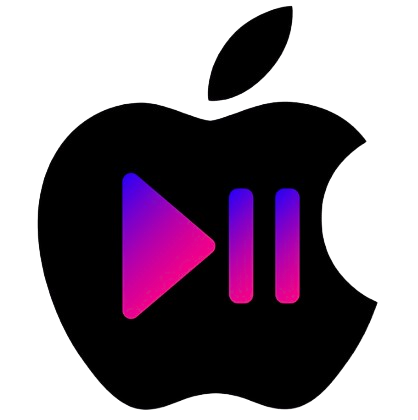
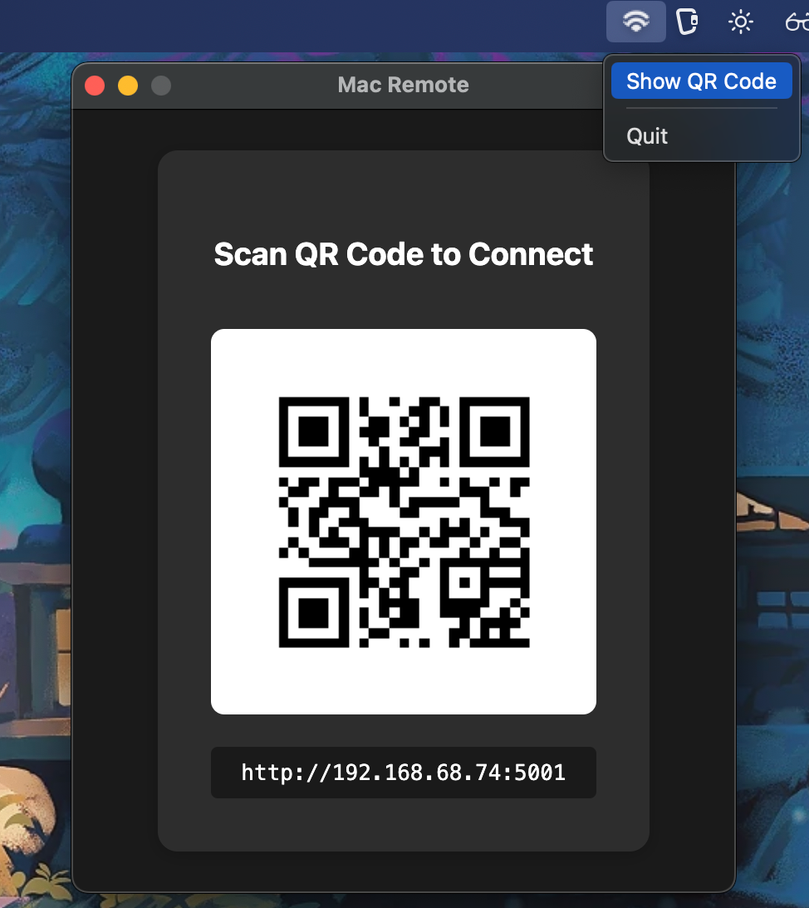
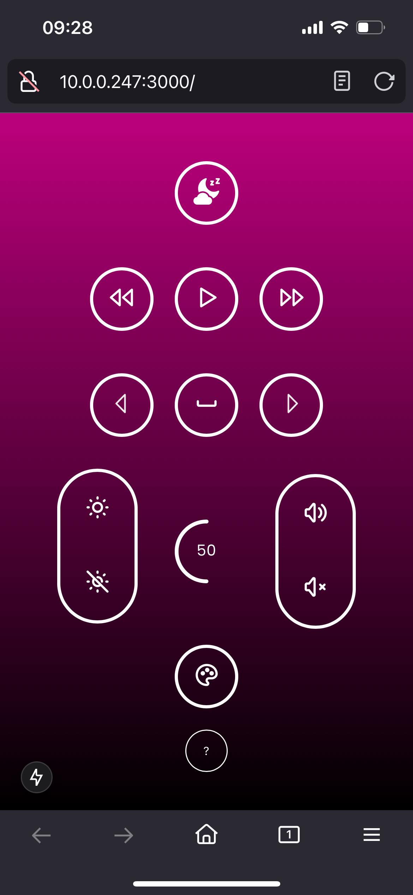

# MacOS Local Area Network Remote 
Enables your phone to trigger keypresses/OS events on a Mac over HTTP using TCP/IP

[Download Mac Remote (latest release)](https://github.com/akleventis/lan_mac_remote/releases/latest)

Big shoutout to Tanner Roof [@rooftb](https://github.com/rooftb) for helping out with the client-side UX

## Overview
This application runs a Go server on your Mac that exposes an API for triggering keypresses and system events. It also serves a locally hosted Next.js static build, accessible from any device on the same local network.



### Available OS Actions
- Play / Pause
- Previous / Next Track
- Sleep
- Arrow Key Left / Right
- Brightness Up / Down
- Volume Up / Down
- Spacebar



### UI Features
- Background color picker modal (saves preference locally)
- Info page displaying icon-to-action mappings


### System Requirements
- Apple Silicon (arm64, M1 or newer)
- macOS 11 Big Sur or later

### Installation
1. Download the DMG file
2. Drag Mac Remote to your Applications folder
3. Launch app from Applications folder
5. Eject DMG file

### macOS Gatekeeper Warnings

You may encounter one or both of the following errors when launching the app for the first time. This happens because the app isn't signed with an Apple Developer certificate ($99/year — no thanks).

1. `“Mac Remote” is damaged and can’t be opened. You should eject the disk image.`

Fix: Remove the quarantine attribute via
```bash
xattr -d com.apple.quarantine "/path/to/Mac Remote.app"
```

### Accessibility
You will need to update two settings in macOS to grant permission:

1. **System Events** – corresponds to play/prev/next track  
   > **System Settings → Privacy & Security → Automation**  
   Locate **Mac Remote** and toggle **System Events** on.

2. **Basic Accessibility** – corresponds to keystrokes  
   > **System Settings → Privacy & Security → Accessibility**  
   Locate **Mac Remote** and toggle it on.

## Developer Overview

### Components

[client](./client/): Static Next.js build served through go server. Runs on a device connected to the same network and acts as the user interface for sending commands

[server](./server/api.go): Go server running on mac that handles triggering OS operations based on incoming http requests. Includes fileserver for Next.js static build

[electron](./electron/): Desktop application UI with a menu tray interface. Opens a window to display the QR code and server IP address


### Setup
1. Ensure [go 1.23](https://go.dev/doc/install) is installed on system 
1. Install qrencode for QR code generation of the IP address landing page via mobile device
    - `brew install qrencode`
1. Clone repository 
    - `git clone https://github.com/akleventis/lan_mac_remote.git`
1. Install npm dependencies
    -  `cd client && npm install`

### Scripts
| file | description|
| :--: | :--: |
|[start_client.sh](./scripts/start_client.sh)| Launches the client app locally, making it accessible on the local network |
|[start_server.sh](./scripts/start_server.sh)| Starts the Go server in development mode |
|[start_app_dev.sh](./scripts/start_app_dev.sh)| Runs both the client and server for local development |
|[start_app_prod.sh](./scripts/start_app_prod.sh)| Builds the Next.js static export and Go binary, then runs the binary |
|[build_client.sh](./scripts/build_client.sh)| Builds the Next.js static export |
|[build_server.sh](./scripts/build_server.sh)| Compiles Go binary |
|[build_app.sh](./scripts/build_app.sh)| Compiles the Next.js static export and Go binary without running them |

> Note: You may need to update permissions to make executable: `chmod +x scripts/*`

### Electron
Electron is the desktop application that launches the go_binary executable and opens the user interface
- `cd electron && npm start`

## Support
- For support, please [open an issue](https://github.com/akleventis/lan_mac_remote/issues) 
