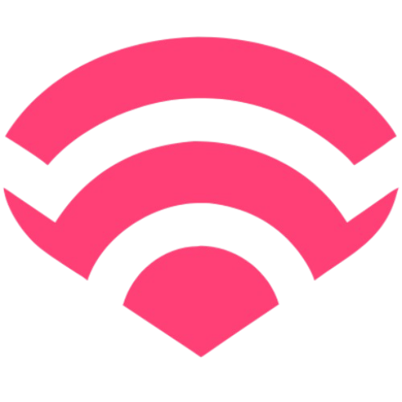

# Local Area Network Remote for Macs 
Application that allows your phone to trigger keypresses/OS events on a Mac over HTTP using TCP/IP

[Download Mac Remote v1.0.0](https://github.com/akleventis/lan_mac_remote/releases/tag/v1.0.0)

## Overview

[client](./client/): Static Next.js build served through go server. Runs on a device connected to the same network and acts as the user interface for sending commands

[server](./server/api.go): Go server running on mac that handles triggering OS operations based on incoming http requests. Includes fileserver for Next.js static build

[electron](./electron/): Desktop application UI with a menu tray interface. Opens a window to display the QR code and server IP address

### Available OS Actions
- play / pause
- prev / next track
- sleep
- arrow key left / right
- brightness up / down
- volume up / down
- spacebar

## Developer Setup
1. Ensure [go 1.23](https://go.dev/doc/install) is installed on system 
1. Install qrencode for QR code generation of the IP address landing page via mobile device
    - `brew install qrencode`
1. Clone repository 
    - `git clone https://github.com/akleventis/lan_mac_remote.git`
1. Install npm dependencies
    -  `cd client && npm install`

### Scripts
| file | description|
| :--: | :--: |
|[start_client.sh](./scripts/start_client.sh)| Launches the client app locally, making it accessible on the local network |
|[start_server.sh](./scripts/start_server.sh)| Starts the Go server in development mode |
|[start_app_dev.sh](./scripts/start_app_dev.sh)| Runs both the client and server for local development |
|[start_app_prod.sh](./scripts/start_app_prod.sh)| Builds the Next.js static export and Go binary, then runs the binary |
|[build_client.sh](./scripts/build_client.sh)| Compiles Go binary |
|[build_server.sh](./scripts/build_server.sh)| Compiles Go binary |
|[build_app.sh](./scripts/build_app.sh)| Compiles the Next.js static export and Go binary without running them |

> Note: You may need to update permissions to make executable: `chmod +x scripts/*`

### Electron
Electron is the desktop application that launches the go_binary executable and opens the user interface
- `cd electron && npm start`